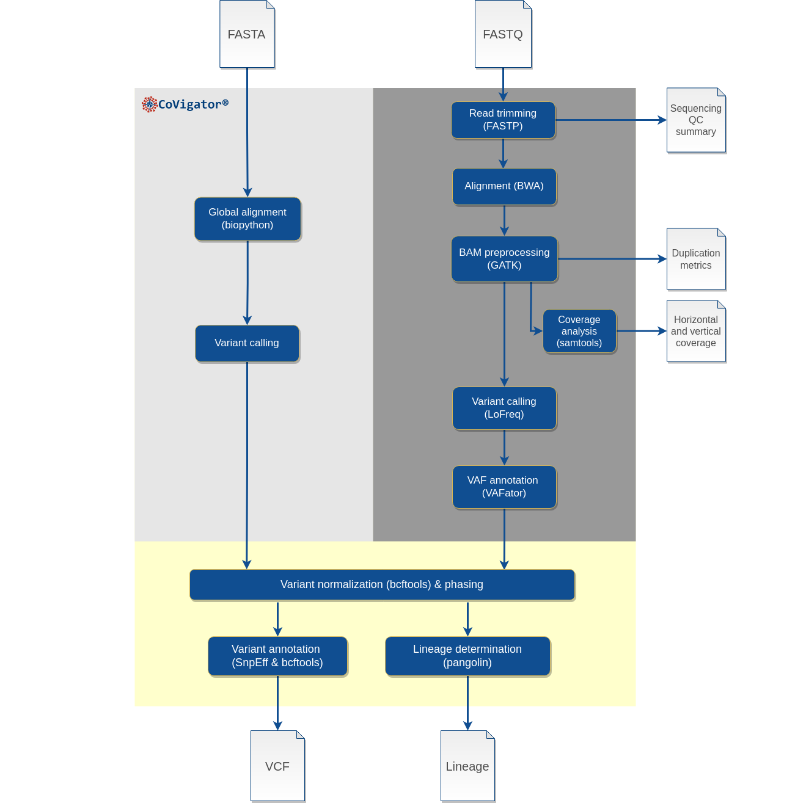

# CoVigator pipeline: variant detection pipeline for Sars-CoV-2

[](https://zenodo.org/badge/latestdoi/374669617)
[](https://github.com/TRON-Bioinformatics/covigator-ngs-pipeline/actions/workflows/automated_tests.yml)
[](https://www.nextflow.io/)
[](https://opensource.org/licenses/MIT)


The Covigator pipeline processes SARS-CoV-2 FASTQ or FASTA files into annotated and normalized analysis ready VCF files.
It also classifies samples into lineages using pangolin.
The pipeline is implemented in the Nextflow framework (Di Tommaso, 2017), it is a stand-alone pipeline that can be
used independently of the CoVigator dashboard and knowledge base.

Although it is configured by default for SARS-CoV-2 it can be employed for the analysis of other microbial organisms 
if the required references are provided.

The result of the pipeline is one or more annotated VCFs with the list of SNVs and indels ready for analysis.

The results from the CoVigator pipeline populate our CoVigator dashboard [https://covigator.tron-mainz.de](https://covigator.tron-mainz.de) 

**Table of Contents**

1. [Two pipelines in one](#id1)
2. [Implementation](#id2)
3. [How to run](#id3)
4. [Understanding the output](#id4)
6. [Annotation resources](#id5)
7. [Future work](#id6)
8. [Bibliography](#id7)


## Two pipelines in one

In CoVigator we analyse samples from two different formats, FASTQ files (e.g.: as provided by the European Nucleotide 
Archive) and FASTA files containing a consensus assembly. While from the first we get the raw reads, 
from the second we obtain already assembled genomes. Each of these formats has to be 
analysed differently. Also, the output data that we can obtain from each of these is different.



### Pipeline for FASTQ files

When FASTQ files are provided the pipeline includes the following steps:
- **Trimming**. `fastp` is used to trim reads with default values. This step also includes QC filtering.
- **Alignment**. `BWA mem 2` is used for the alignment of single or paired end samples.
- **BAM preprocessing**. BAM files are prepared and duplicate reads are marked using GATK and Sambamba tools.
- **Primer trimming**. When a BED with primers is provided, these are trimmed from the reads using iVar. This is applicable to the results from all variant callers.
- **Coverage analysis**. `samtools coverage` and `samtools depth` are used to compute the horizontal and vertical 
  coverage respectively.
- **Variant calling**. Four different variant callers are employed: BCFtools, LoFreq, iVar and GATK. 
  Subsequent processing of resulting VCF files is independent for each caller.
- **Variant normalization**. `bcftools norm` is employed to left align indels, trim variant calls and remove variant duplicates.
- **Phasing**. Clonal mutations (ie: VAF >= 0.8) occurring in the same amino acid are merged for its correct functional annotation.
- **Variant annotation**. `SnpEff` is employed to annotate the variant consequences of variants,
  `VAFator` is employed to add technical annotations and finally
  `bcftools annotate` is employed to add additional annotations.
- **Lineage determination**. `pangolin` is used for this purpose, this runs over the results from each of the variant callers separately.

Both single end and paired end FASTQ files are supported.

### Pipeline for FASTA files

When a FASTA file is provided with a single assembly sequence the pipeline includes the following steps:
- **Variant calling**. A Smith-Waterman global alignment is performed against the reference sequence to call SNVs and 
  indels. Indels longer than 50 bp and at the beginning or end of the assembly sequence are excluded. Any mutation where
  either reference or assembly contain an N is excluded.
- **Variant normalization**. Same as described above.
- **Phasing**. mutations occurring in the same amino acid are merged for its correct annotation.
- **Variant annotation**. Same as described above with the exception of `VAFator`.
- **Lineage determination**. `pangolin` is used for this purpose.

The FASTA file is expected to contain a single assembly sequence. 
Bear in mind that only clonal variants can be called on the assembly.

## Implementation

The pipeline is implemented as a Nextflow workflow with its DSL2 syntax.
The dependencies are managed through a conda environment to ensure version traceability and reproducibility.
The references for SARS-CoV-2 are embedded in the pipeline.
The pipeline is based on a number of third-party tools, plus a custom implementation based on biopython (Cock, 2009) 
for the alignment and subsequent variant calling over a FASTA file.

All code is open sourced in GitHub [https://github.com/TRON-Bioinformatics/covigator-ngs-pipeline](https://github.com/TRON-Bioinformatics/covigator-ngs-pipeline)
and made available under the MIT license. We welcome any contribution. 
If you have troubles using the CoVigator pipeline or you find an issue, we will be thankful if you would report a ticket 
in GitHub.

The alignment, BAM preprocessing and variant normalization pipelines are based on the implementations in additional 
Nextflow pipelines within the TronFlow initiative [https://tronflow-docs.readthedocs.io/](https://tronflow-docs.readthedocs.io/). 


### Variant annotations

The variants derived from a FASTQ file are annotated on the `FILTER` column using the VAFator 
(https://github.com/TRON-Bioinformatics/vafator) variant allele frequency 
(VAF) into `LOW_FREQUENCY`, `SUBCLONAL` and finally `PASS` variants correspond to clonal variants. By default, 
variants with a VAF < 20 % are considered `LOW_FREQUENCY` and variants with a VAF >= 20 % and < 80 % are considered 
`SUBCLONAL`. This thresholds can be changed with the parameters `--low_frequency_variant_threshold` and
`--subclonal_variant_threshold`.

VAFator technical annotations:

- `INFO/vafator_af`: variant allele frequency of the mutation 
- `INFO/vafator_ac`: number of reads supporting the mutation 
- `INFO/vafator_dp`: total number of reads at the position, in the case of indels this represents the number of reads in the previous position

SnpEff provides the functional annotations. And all mutations are additionally annotated with the following SARS-CoV-2 specific annotations:
- ConsHMM conservation scores as reported in (Kwon, 2021)
- Pfam domains as reported in Ensemble annotations.

Biological annotations: 

- `INFO/ANN` are the SnpEff consequence annotations (eg: overlapping gene, effect of the mutation). 
This are described in detail here [http://pcingola.github.io/SnpEff/se_inputoutput/](http://pcingola.github.io/SnpEff/se_inputoutput/) 
- `INFO/CONS_HMM_SARS_COV_2` is the ConsHMM conservation score in SARS-CoV-2
- `INFO/CONS_HMM_SARBECOVIRUS` is the ConsHMM conservation score among Sarbecovirus
- `INFO/CONS_HMM_VERTEBRATE_COV` is the ConsHMM conservation score among vertebrate Corona virus
- `INFO/PFAM_NAME` is the Interpro name for the overlapping Pfam domains
- `INFO/PFAM_DESCRIPTION` is the Interpro description for the overlapping Pfam domains

This is an example of biological annotations of a missense mutation in the spike protein on the N-terminal subunit 1 domain.
```
ANN=A|missense_variant|MODERATE|S|gene-GU280_gp02|transcript|TRANSCRIPT_gene-GU280_gp02|protein_coding|1/1|c.118G>A|
p.D40N|118/3822|118/3822|40/1273||;CONS_HMM_SARS_COV_2=0.57215;CONS_HMM_SARBECOVIRUS=0.57215;CONS_HMM_VERTEBRATE_COV=0;
PFAM_NAME=bCoV_S1_N;PFAM_DESCRIPTION=Betacoronavirus-like spike glycoprotein S1, N-terminal
```


### Phasing limitations

The phasing implementation is applicable only to clonal mutations. It assumes all clonal mutations are in phase and 
hence it merges those occurring in the same amino acid.
In order to phase intrahost mutations we would need to implement a read-backed phasing approach such as in WhatsHap 
or GATK's ReadBackedPhasing. Unfortunately these tools do not support the scenario of a haploid organism with an
undefined number of subclones.
For this reason, phasing is implemented with custom Python code at `bin/phasing.py`.

### Primers trimming

With some library preparation protocols such as ARTIC it is recommended to trim the primers from the reads.
We have observed that if primers are not trimmed spurious mutations are being called specially SNVs with lower frequencies and long deletions.
Also the variant allele frequencies of clonal mutations are underestimated.

The BED files containing the primers for each ARTIC version can be found at https://github.com/artic-network/artic-ncov2019/tree/master/primer_schemes/nCoV-2019.

If the adequate BED file is provided to the CoVigator pipeline with `--primers` the primers will be trimmed with iVar. 
This affects the output of every variant caller, not only iVar.

### Reference data

The default SARS-CoV-2 reference files correspond to Sars_cov_2.ASM985889v3 and were downloaded from Ensembl servers.
No additional parameter needs to be provided to use the default SARS-CoV-2 reference genome.

#### Using a custom reference genome

These references can be customised to use a different SARS-CoV-2 reference or to analyse a different virus.
Two files need to be provided:
- Use a custom reference genome by providing the parameter `--reference your.fasta`.
- Gene annotation file in GFFv3 format `--gff your.gff`. This is only required to run iVar

Additionally, the FASTA needs bwa indexes, .fai index and a .dict index.
These indexes can be generated with the following two commands:
```
bwa index reference.fasta
samtools faidx reference.fasta
gatk CreateSequenceDictionary --REFERENCE your.fasta
```

**NOTE**: beware that for Nextflow to find these indices the reference needs to be passed as an absolute path.

The SARS-CoV-2 specific annotations will be skipped when using a custom genome.

In order to have SnpEff functional annotations available you will also need to provide three parameters:
- `--snpeff_organism`: organism to annotate with SnpEff (ie: as registered in SnpEff)
- `--snpeff_data`: path to the SnpEff data folder
- `--snpeff_config`: path to the SnpEff config file

### Intrahost mutations

Some mutations may be observed in a subset of the virus sample, this may arise through intrahost virus evolution or
co-infection. Intrahost mutations can only be detected when analysing the raw reads (ie: the FASTQs) 
as in the assembly (ie: the FASTA file) a single virus consensus sequence is represented. 
BCFtools and GATK do not normally capture intrahost mutations; on the other hand LoFreq and iVar both capture
mutations that deviate from a clonal-like VAF. 
Nevertheless, mutations with lower variant allele frequency (VAF) are challenging to distinguish from sequencing and
analytical errors.  

Mutations are annotated on the `FILTER` column using the VAF into three categories: 
- `LOW_FREQUENCY`: subset of intrahost mutations with lowest frequencies, potentially enriched with bad calls (VAF < 20 %).
- `SUBCLONAL`: subset of intrahost mutations with higher frequencies (20 % <= VAF < 80 %).
- `PASS` clonal mutations (VAF >= 80 %)

Other low quality mutations are removed from the output.

The VAF thresholds can be changed with the parameters `--low_frequency_variant_threshold` and
`--subclonal_variant_threshold`.

## How to run

### Requirements

- Nextflow >= 19.10.0
- Java >= 8
- Conda >=4.9

### Testing

To run the workflow on a test assembly dataset run:
```
nextflow run tron-bioinformatics/covigator-ngs-pipeline -profile conda,test_fasta
```

Find the output in the folder `covigator_test_fasta`.

To run the workflow on a test raw reads dataset run:
```
nextflow run tron-bioinformatics/covigator-ngs-pipeline -profile conda,test_fastq
```

Find the output in the folder `covigator_test_fastq`.

The above commands are useful to create the conda environments before hand.

**NOTE**: pangolin is the most time-consuming step of the whole pipeline. To make it faster, locate the conda 
environment that Nextflow created with pangolin (eg: `find $YOUR_NEXTFOW_CONDA_ENVS_FOLDER -name pangolin`) and run
`pangolin --decompress-model`.

### Running

For paired end reads:
```
nextflow run tron-bioinformatics/covigator-ngs-pipeline \
[-r v0.10.0] \
[-profile conda] \
--fastq1 <FASTQ_FILE> \
--fastq2 <FASTQ_FILE> \
--name example_run \
--output <OUTPUT_FOLDER> \
[--reference <path_to_reference>/Sars_cov_2.ASM985889v3.fa] \
[--gff <path_to_reference>/Sars_cov_2.ASM985889v3.gff3]
```

For single end reads:
```
nextflow run tron-bioinformatics/covigator-ngs-pipeline \
[-r v0.10.0] \
[-profile conda] \
--fastq1 <FASTQ_FILE> \
--name example_run \
--output <OUTPUT_FOLDER> \
[--reference <path_to_reference>/Sars_cov_2.ASM985889v3.fa] \
[--gff <path_to_reference>/Sars_cov_2.ASM985889v3.gff3]
```

For assembly:
```
nextflow run tron-bioinformatics/covigator-ngs-pipeline \
[-r v0.10.0] \
[-profile conda] \
--fasta <FASTA_FILE> \
--name example_run \
--output <OUTPUT_FOLDER> \
[--reference <path_to_reference>/Sars_cov_2.ASM985889v3.fa] \
[--gff <path_to_reference>/Sars_cov_2.ASM985889v3.gff3]
```

For batch processing of reads use `--input_fastqs_list` and `--name`.
```
nextflow run tron-bioinformatics/covigator-ngs-pipeline [-profile conda] --input_fastqs_list <TSV_FILE> --library <paired|single> --output <OUTPUT_FOLDER> [--reference <path_to_reference>/Sars_cov_2.ASM985889v3.fa] [--gff <path_to_reference>/Sars_cov_2.ASM985889v3.gff3]
```
where the TSV file contains two or three columns tab-separated columns **without header**. Columns: sample name, path to FASTQ 1 and optionally path to FASTQ 2. 

| Sample    | FASTQ 1                       | FASTQ 2 (optional column)     |
|-----------|-------------------------------|-------------------------------|
| sample1   | /path/to/sample1_fastq1.fastq | /path/to/sample1_fastq2.fastq |
| sample2   | /path/to/sample2_fastq1.fastq | /path/to/sample2_fastq2.fastq |
| ...       | ...                           | ...                           |


For batch processing of assemblies use `--input_fastas_list`.
```
nextflow run tron-bioinformatics/covigator-ngs-pipeline [-profile conda] --input_fastas_list <TSV_FILE> --library <paired|single> --output <OUTPUT_FOLDER> [--reference <path_to_reference>/Sars_cov_2.ASM985889v3.fa] [--gff <path_to_reference>/Sars_cov_2.ASM985889v3.gff3]
```
where the TSV file contains two columns tab-separated columns **without header**. Columns: sample name and path to FASTA.

| Sample    | FASTA                  | 
|-----------|------------------------|
| sample1   | /path/to/sample1.fasta |
| sample2   | /path/to/sample2.fasta |
| ...       | ...                    |


### Getting help

You can always contact us directly or create a GitHub issue, otherwise see all available options using `--help`:
```
$ nextflow run tron-bioinformatics/covigator-ngs-pipeline -profile conda --help

Usage:
    nextflow run tron-bioinformatics/covigator-ngs-pipeline -profile conda --help

Input:
    * --fastq1: the first input FASTQ file (not compatible with --fasta)
    * --fasta: the FASTA file containing the assembly sequence (not compatible with --fastq1)
    * --name: the sample name, output files will be named after this name
    * --output: the folder where to publish output
    * --input_fastqs_list: alternative to --name and --fastq1 for batch processing
    * --library: required only when using --input_fastqs
    * --input_fastas_list: alternative to --name and --fasta for batch processing

Optional input only required to use a custom reference:
    * --reference: the reference genome FASTA file, *.fai, *.dict and bwa indexes are required.
    * --gff: the GFFv3 gene annotations file (required to run iVar and to phase mutations from all variant callers)    
    * --snpeff_data: path to the SnpEff data folder, it will be useful to use the pipeline on other virus than SARS-CoV-2
    * --snpeff_config: path to the SnpEff config file, it will be useful to use the pipeline on other virus than SARS-CoV-2
    * --snpeff_organism: organism to annotate with SnpEff, it will be useful to use the pipeline on other virus than SARS-CoV-2

Optional input:
    * --fastq2: the second input FASTQ file
    * --primers: a BED file containing the primers used during library preparation. If provided primers are trimmed from the reads.
    * --min_base_quality: minimum base call quality to take a base into account for variant calling (default: 20)
    * --min_mapping_quality: minimum mapping quality to take a read into account for variant calling (default: 20)
    * --vafator_min_base_quality: minimum base call quality to take a base into account for VAF annotation (default: 0)
    * --vafator_min_mapping_quality: minimum mapping quality to take a read into account for VAF annotation (default: 0)
    * --low_frequency_variant_threshold: VAF threshold to mark a variant as low frequency (default: 0.2)
    * --subclonal_variant_threshold: VAF superior threshold to mark a variant as subclonal (default: 0.8)
    * --memory: the ammount of memory used by each job (default: 3g)
    * --cpus: the number of CPUs used by each job (default: 1)
    * --skip_lofreq: skips calling variants with LoFreq
    * --skip_gatk: skips calling variants with GATK
    * --skip_bcftools: skips calling variants with BCFTools
    * --skip_ivar: skips calling variants with iVar
    * --skip_pangolin: skips lineage determination with pangolin
    * --match_score: global alignment match score, only applicable for assemblies (default: 2)
    * --mismatch_score: global alignment mismatch score, only applicable for assemblies (default: -1)
    * --open_gap_score: global alignment open gap score, only applicable for assemblies (default: -3)
    * --extend_gap_score: global alignment extend gap score, only applicable for assemblies (default: -0.1)
    * --skip_sarscov2_annotations: skip some of the SARS-CoV-2 specific annotations (default: false)
    * --keep_intermediate: keep intermediate files (ie: BAM files and intermediate VCF files)
    * --args_bcftools_mpileup: additional arguments for bcftools mpileup command (eg: --args_bcftools_mpileup='--ignore-overlaps')
    * --args_bcftools_call: additional arguments for bcftools call command (eg: --args_bcftools_call='--something')
    * --args_lofreq: additional arguments for lofreq command (eg: --args_lofreq='--something')
    * --args_gatk: additional arguments for gatk command (eg: --args_gatk='--something')
    * --args_ivar_samtools: additional arguments for ivar samtools mpileup command (eg: --args_ivar_samtools='--ignore-overlaps')
    * --args_ivar: additional arguments for ivar command (eg: --args_ivar='--something')

Output:
    * Output a VCF file for each of BCFtools, GATK, LoFreq and iVar when FASTQ files are
    provided or a single VCF obtained from a global alignment when a FASTA file is provided.
    * A pangolin results file for each of the VCF files.
    * Only when FASTQs are provided:
      * FASTP statistics
      * Depth and breadth of coverage analysis results
      
```

## Understanding the output

Although the VCFs are normalized for both pipelines, the FASTQ pipeline runs four variant callers, while the FASTA
pipeline runs a single variant caller. Also, there are several metrics in the FASTQ pipeline that are not present
in the output of the FASTA pipeline. Here we will describe these outputs.

### FASTQ pipeline output

Find in the table below a description of each of the expected files and a link to a sample file for the FASTQ pipeline.
The VCF files will be described in more detail later.

| Name                            | Description                                                    | Sample file                                                                                                                                       |
|---------------------------------|----------------------------------------------------------------|---------------------------------------------------------------------------------------------------------------------------------------------------|
| $NAME.fastp_stats.json          | Output metrics of the fastp trimming process in JSON format    | [ERR4145453.fastp_stats.json](_static/covigator_pipeline_sample_output_reads/ERR4145453.fastp_stats.json)                                         |
| $NAME.fastp_stats.html          | Output metrics of the fastp trimming process in HTML format    | [ERR4145453.fastp_stats.html](_static/covigator_pipeline_sample_output_reads/ERR4145453.fastp_stats.html)                                         |
| $NAME.deduplication_metrics.txt | Deduplication metrics                                          | [ERR4145453.deduplication_metrics.txt](_static/covigator_pipeline_sample_output_reads/ERR4145453.deduplication_metrics.txt)                       |
| $NAME.coverage.tsv              | Coverage metrics (eg: mean depth, % horizontal coverage)       | [ERR4145453.coverage.tsv](_static/covigator_pipeline_sample_output_reads/ERR4145453.coverage.tsv)                                                 |
| $NAME.depth.tsv                 | Depth of coverage per position                                 | [ERR4145453.depth.tsv](_static/covigator_pipeline_sample_output_reads/ERR4145453.depth.tsv)                                                       |
| $NAME.bcftools.vcf.gz           | Bgzipped, tabix-indexed and annotated output VCF from BCFtools | [ERR4145453.bcftools.normalized.annotated.vcf.gz](_static/covigator_pipeline_sample_output_reads/ERR4145453.bcftools.normalized.annotated.vcf.gz) |
| $NAME.gatk.vcf.gz               | Bgzipped, tabix-indexed and annotated output VCF from GATK     | [ERR4145453.gatk.normalized.annotated.vcf.gz](_static/covigator_pipeline_sample_output_reads/ERR4145453.gatk.normalized.annotated.vcf.gz)         |
| $NAME.lofreq.vcf.gz             | Bgzipped, tabix-indexed and annotated output VCF from LoFreq   | [ERR4145453.lofreq.normalized.annotated.vcf.gz](_static/covigator_pipeline_sample_output_reads/ERR4145453.lofreq.normalized.annotated.vcf.gz)     |
| $NAME.ivar.vcf.gz               | Bgzipped, tabix-indexed and annotated output VCF from LoFreq   | [ERR4145453.ivar.tsv](_static/covigator_pipeline_sample_output_reads/ERR4145453.ivar.tsv)                                                         |
| $NAME.lofreq.pangolin.csv       | Pangolin CSV output file derived from LoFreq mutations         | [ERR4145453.lofreq.pangolin.csv](_static/covigator_pipeline_sample_output_reads/ERR4145453.lofreq.pangolin.csv)                                              |


### FASTA pipeline output

The FASTA pipeline returns a single VCF file. The VCF files will be described in more detail later.

| Name                        | Description                                                  | Sample file                                                                                          |
|-----------------------------|--------------------------------------------------------------|------------------------------------------------------------------------------------------------------|
| $NAME.assembly.vcf.gz | Bgzipped, tabix-indexed and annotated output VCF | [ERR4145453.assembly.normalized.annotated.vcf.gz](_static/covigator_pipeline_sample_output_assembly/hCoV-19_NTXX.assembly.normalized.annotated.vcf.gz) |


## Annotations resources

SARS-CoV-2 ASM985889v3 references were downloaded from Ensembl on 6th of October 2020:
- ftp://ftp.ensemblgenomes.org/pub/viruses/fasta/sars_cov_2/dna/Sars_cov_2.ASM985889v3.dna.toplevel.fa.gz
- ftp://ftp.ensemblgenomes.org/pub/viruses/gff3/sars_cov_2/Sars_cov_2.ASM985889v3.101.gff3.gz

ConsHMM mutation depletion scores downloaded on 1st of July 2021:
- https://github.com/ernstlab/ConsHMM_CoV/blob/master/wuhCor1.mutDepletionConsHMM.bed
- https://github.com/ernstlab/ConsHMM_CoV/blob/master/wuhCor1.mutDepletionSarbecovirusConsHMM.bed
- https://github.com/ernstlab/ConsHMM_CoV/blob/master/wuhCor1.mutDepletionVertebrateCoVConsHMM.bed

Gene annotations including Pfam domains downloaded from Ensembl on 25th of February 2021 from:
- ftp://ftp.ensemblgenomes.org/pub/viruses/json/sars_cov_2/sars_cov_2.json


## Future work

- Primer trimming on an arbitrary sequencing library.
- Validation of intrahost variant calls.
- Pipeline for Oxford Nanopore technology.
- Variant calls from assemblies contain an abnormally high number of deletions of size greater than 3 bp. This
is a technical artifact that would need to be avoided.

## Bibliography

- Di Tommaso, P., Chatzou, M., Floden, E. W., Barja, P. P., Palumbo, E., & Notredame, C. (2017). Nextflow enables reproducible computational workflows. Nature Biotechnology, 35(4), 316–319. https://doi.org/10.1038/nbt.3820
- Vasimuddin Md, Sanchit Misra, Heng Li, Srinivas Aluru. Efficient Architecture-Aware Acceleration of BWA-MEM for Multicore Systems. IEEE Parallel and Distributed Processing Symposium (IPDPS), 2019.
- Adrian Tan, Gonçalo R. Abecasis and Hyun Min Kang. Unified Representation of Genetic Variants. Bioinformatics (2015) 31(13): 2202-2204](http://bioinformatics.oxfordjournals.org/content/31/13/2202) and uses bcftools [Li, H. (2011). A statistical framework for SNP calling, mutation discovery, association mapping and population genetical parameter estimation from sequencing data. Bioinformatics (Oxford, England), 27(21), 2987–2993. 10.1093/bioinformatics/btr509
- Danecek P, Bonfield JK, Liddle J, Marshall J, Ohan V, Pollard MO, Whitwham A, Keane T, McCarthy SA, Davies RM, Li H. Twelve years of SAMtools and BCFtools. Gigascience. 2021 Feb 16;10(2):giab008. doi: 10.1093/gigascience/giab008. PMID: 33590861; PMCID: PMC7931819.
- Van der Auwera GA, Carneiro M, Hartl C, Poplin R, del Angel G, Levy-Moonshine A, Jordan T, Shakir K, Roazen D, Thibault J, Banks E, Garimella K, Altshuler D, Gabriel S, DePristo M. (2013). From FastQ Data to High-Confidence Variant Calls: The Genome Analysis Toolkit Best Practices Pipeline. Curr Protoc Bioinformatics, 43:11.10.1-11.10.33. DOI: 10.1002/0471250953.bi1110s43.
- Martin, M., Patterson, M., Garg, S., O Fischer, S., Pisanti, N., Klau, G., Schöenhuth, A., & Marschall, T. (2016). WhatsHap: fast and accurate read-based phasing. BioRxiv, 085050. https://doi.org/10.1101/085050
- Danecek, P., & McCarthy, S. A. (2017). BCFtools/csq: haplotype-aware variant consequences. Bioinformatics, 33(13), 2037–2039. https://doi.org/10.1093/bioinformatics/btx100
- Wilm, A., Aw, P. P. K., Bertrand, D., Yeo, G. H. T., Ong, S. H., Wong, C. H., Khor, C. C., Petric, R., Hibberd, M. L., & Nagarajan, N. (2012). LoFreq: A sequence-quality aware, ultra-sensitive variant caller for uncovering cell-population heterogeneity from high-throughput sequencing datasets. Nucleic Acids Research, 40(22), 11189–11201. https://doi.org/10.1093/nar/gks918
- Grubaugh, N. D., Gangavarapu, K., Quick, J., Matteson, N. L., De Jesus, J. G., Main, B. J., Tan, A. L., Paul, L. M., Brackney, D. E., Grewal, S., Gurfield, N., Van Rompay, K. K. A., Isern, S., Michael, S. F., Coffey, L. L., Loman, N. J., & Andersen, K. G. (2019). An amplicon-based sequencing framework for accurately measuring intrahost virus diversity using PrimalSeq and iVar. Genome Biology, 20(1), 8. https://doi.org/10.1186/s13059-018-1618-7
- Shifu Chen, Yanqing Zhou, Yaru Chen, Jia Gu; fastp: an ultra-fast all-in-one FASTQ preprocessor, Bioinformatics, Volume 34, Issue 17, 1 September 2018, Pages i884–i890, https://doi.org/10.1093/bioinformatics/bty560
- Kwon, S. Bin, & Ernst, J. (2021). Single-nucleotide conservation state annotation of the SARS-CoV-2 genome. Communications Biology, 4(1), 1–11. https://doi.org/10.1038/s42003-021-02231-w
- Cock, P. J., Antao, T., Chang, J. T., Chapman, B. A., Cox, C. J., Dalke, A., et al. (2009). Biopython: freely available Python tools for computational molecular biology and bioinformatics. Bioinformatics, 25(11), 1422–1423.
- Artem Tarasov, Albert J. Vilella, Edwin Cuppen, Isaac J. Nijman, Pjotr Prins, Sambamba: fast processing of NGS alignment formats, Bioinformatics, Volume 31, Issue 12, 15 June 2015, Pages 2032–2034, https://doi.org/10.1093/bioinformatics/btv098
